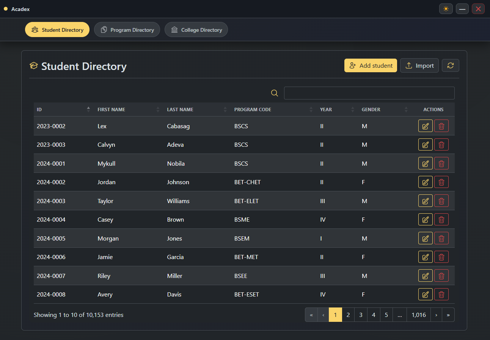

<div align="center">
    <picture>
    <source srcset="docs/logo_dark.png" media="(prefers-color-scheme: dark)">
    <source srcset="docs/logo_light.png" media="(prefers-color-scheme: light)">
    
    </picture>
</div>

<p align="center">
  
  
  
  
  
  
</p>

A lightweight desktop application for managing academic directory records — Students, Programs, and Colleges — backed by local CSV files and delivered via the Neutralino runtime.

<div align="center">



</div>

---

## 📋 Overview

Acadex is a desktop app built with Neutralino.js and a Bootstrap 5 UI. It provides full CRUD operations across three linked directories with fast, searchable, and sortable DataTables grids. All data is persisted locally in plain CSV files with schema validation on every load.

---

## 🧾 Data Model

### 👤 Students

| Column | Type | Constraints | Description |
|---|---|---|---|
| `ID` | String | Primary Key, Required | Unique student identifier |
| `First Name` | String | Required | Student's first name |
| `Last Name` | String | Required | Student's last name |
| `Program Code` | String | FK → Programs.Code, nullable (`NULL`) | Enrolled program |
| `Year` | String | Required | Year level (e.g., `1`, `2`, `3`, `4`) |
| `Gender` | String | Required | Gender (e.g., `Male`, `Female`) |

**CSV header:** `id,firstname,lastname,programcode,year,gender`

---

### 📄 Programs

| Column | Type | Constraints | Description |
|---|---|---|---|
| `Code` | String | Primary Key, Required | Unique program code (e.g., `BSCS`) |
| `Name` | String | Required | Full program name |
| `College` | String | FK → Colleges.Code, nullable (`NULL`) | Parent college |

**CSV header:** `code,name,college`

---

### 🏛️ Colleges

| Column | Type | Constraints | Description |
|---|---|---|---|
| `Code` | String | Primary Key, Required | Unique college code (e.g., `CCS`) |
| `Name` | String | Required | Full college name |

**CSV header:** `code,name`

---

## 🗂️ Project Structure

```
acadex/
├── neutralino.config.json       # App configuration (window, CLI, API allowlist)
├── src/
│   ├── index.html               # Single-page shell — layout, modals, script tags
│   ├── css/
│   │   ├── styles.css           # Custom app styles
│   │   ├── bootstrap/
│   │   │   └── bootstrap.css    # Bootstrap 5 full build
│   │   ├── datatables/
│   │   │   └── datatables.css   # DataTables + extensions CSS
│   │   └── heroicons/
│   │       └── heroicons.css    # Heroicon CSS sprite references
│   ├── img/
│   │   ├── appIcon.ico          # Application window icon
│   │   └── heroicons/
│   │       ├── outline/         # Outline SVG icons
│   │       └── solid/           # Solid SVG icons
│   └── js/
│       ├── main.js              # Entry point — init, DataTable setup, theme, nav
│       ├── core/
│       │   ├── csv.js           # CSV config, read/write/parse/delete utilities
│       │   ├── students.js      # Student CRUD, table render, modal logic
│       │   ├── programs.js      # Program CRUD, table render, modal logic
│       │   └── colleges.js      # College CRUD, table render, modal logic
│       ├── bootstrap/
│       │   └── bootstrap.js     # Bootstrap 5 JS bundle
│       ├── datatables/
│       │   └── datatables.js    # DataTables + Responsive + FixedHeader + Select
│       ├── jquery/
│       │   └── jquery.js        # jQuery full build
│       ├── moment/
│       │   └── moment.js        # Moment.js date library
│       └── neutralino/
│           └── neutralino.js    # Neutralino client library
└── csv/                         # Auto-created on first run
    ├── students.csv
    ├── programs.csv
    └── colleges.csv
```

---

## 🚀 Getting Started

### ✅ Prerequisites

| Requirement | Notes |
|---|---|
| [Node.js](https://nodejs.org/) 18+ | Required for the Neutralino CLI |
| [Neutralino CLI](https://neutralino.js.org/docs/cli/neu-cli) | Install globally: `npm install -g @neutralinojs/neu` |

### ▶️ Run in Development

```bash
# Clone the repository
git clone <repo-url>
cd acadex

# Install neutralino libraries
neu update

# Start the development server with hot reload
neu run
```

The app window will open automatically. The `csv/` directory is created on first launch if it does not exist.

### 📦 Build for Production

```bash
# Build binaries for the current platform
neu build
```

To build for a specific platform, refer to the [Neutralino build documentation](https://neutralino.js.org/docs/cli/neu-cli#neu-build).